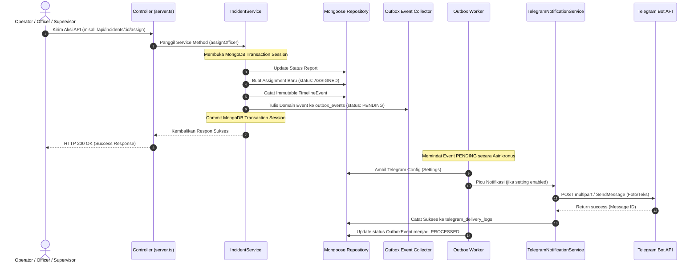

# EYECO Incident Management V3 - Software Design Detail (SDD)
## Spesifikasi Desain Detail Perangkat Lunak (Updated)

Dokumen ini menjelaskan detail implementasi perangkat lunak untuk Core Incident Management EYECO. Ini mencakup rancangan kelas, antarmuka (interface), katalog kode error, dan diagram urutan (sequence diagram).

---

## 1. Class & Repository Design

Untuk mematuhi **Repository & DTO Pattern**, struktur kelas dirancang agar tidak memaparkan dokumen Mongoose ke lapisan Service:

```mermaid
classDiagram
  direction TB
  class ReportRepository {
    +findById(id: string) Promise~IReport~
    +findByLegacyId(id: number) Promise~IReport~
    +update(id: string, data: Partial~IReport~, session: ClientSession) Promise~IReport~
    +softDelete(id: string, actorId: string, actorName: string, reason: string, session: ClientSession) Promise~IReport~
  }

  class AssignmentRepository {
    +findById(id: string) Promise~IAssignment~
    +findActiveByReportId(reportId: string) Promise~IAssignment~
    +create(data: Partial~IAssignment~, session: ClientSession) Promise~IAssignment~
    +update(id: string, data: Partial~IAssignment~, session: ClientSession) Promise~IAssignment~
  }

  class ResolutionRepository {
    +create(data: Partial~IResolution~, session: ClientSession) Promise~IResolution~
    +findById(id: string) Promise~IResolution~
    +update(id: string, data: Partial~IResolution~, session: ClientSession) Promise~IResolution~
  }

  class StateMachine {
    +validateTransition(from: string, to: string, role: string) boolean
  }

  class PermissionService {
    +canPerformAction(action: string, user: IUser, report: IReport) boolean
  }

  class TelegramNotificationService {
    -botToken: string
    +sendPhotoWithAlert(chatId: string, imagePath: string, caption: string) Promise~number~
    +sendReplyText(chatId: string, replyToMessageId: number, text: string) Promise~number~
  }

  class IncidentService {
    +validateIncident(reportId: string, status: string, notes: string, actor: IUser, meta: RequestMeta) Promise~IReport~
    +assignOfficer(reportId: string, officerId: string, actor: IUser, meta: RequestMeta) Promise~IReport~
    +arriveAtSite(reportId: string, actor: IUser, meta: RequestMeta) Promise~IReport~
    +resolveIncident(reportId: string, fieldNotes: string, images: Attachment[], actor: IUser, meta: RequestMeta) Promise~IReport~
    +approveResolution(reportId: string, approved: boolean, notes: string, actor: IUser, meta: RequestMeta) Promise~IReport~
  }

  IncidentService ..> ReportRepository
  IncidentService ..> AssignmentRepository
  IncidentService ..> ResolutionRepository
  IncidentService ..> StateMachine
  IncidentService ..> PermissionService
```



---

## 2. Sequence Diagram - Alur Validasi, Penugasan & Penyelesaian dengan Telegram Bot

Berikut adalah visualisasi alur transaksi terpadu di dalam database (dibungkus oleh MongoDB Session Transaction) beserta pemrosesan asinkronus Outbox Worker ke Telegram API:



---

## 3. Format Pesan Telegram (Telegram Message Specs)

Untuk mempermudah koordinasi, pesan Telegram Bot disusun dengan detail visual dan reply thread:

### A. Deteksi Awal (Alert Utama)
Mengirimkan gambar CCTV dengan caption status menanti review:
```text
🚨 EYECO INCIDENT ALERT

📍 Lokasi      : Kali Sukapura
🆔 Incident    : #0058
🤖 AI Status    : TINGGI (92% Confidence)
📌 Status      : WAITING REVIEW
🕒 Waktu       : 01 Juli 2026 14:43 WIB
```

### B. Penunjukan Petugas (Reply Thread ke Alert Utama)
Mengirimkan reply teks ke pesan alert asli menggunakan `replyToMessageId` yang tersimpan di `telegram_delivery_logs`:
```text
👷 INCIDENT ASSIGNED

Incident       : #0058
Officer        : Andre
Agency         : DLH
```

### C. Penutupan Kasus / Closed (Reply Thread ke Alert Utama)
Mengirimkan reply teks penutupan kasus beserta total durasi SLA terhitung:
```text
✅ INCIDENT CLOSED

Incident       : #0058
Petugas        : Andre
Supervisor     : Budi
Total SLA      : 1 jam 14 menit
```

---

## 4. Katalog Error Sistem (Error Catalog)

| Kode Error | HTTP Status | Deskripsi |
| :--- | :--- | :--- |
| `INCIDENT_NOT_FOUND` | `404 Not Found` | Laporan insiden tidak ditemukan atau telah di-soft-delete. |
| `USER_NOT_FOUND` | `404 Not Found` | User tidak ditemukan di sistem. |
| `FORBIDDEN_ACTION` | `403 Forbidden` | Peran pengguna melanggar aturan hak akses / Ownership. |
| `INVALID_TRANSITION` | `400 Bad Request` | Transaksi status ditolak oleh FSM. |
| `ASSIGNMENT_NOT_FOUND` | `404 Not Found` | Penugasan aktif tidak ditemukan. |
| `FILE_UPLOAD_FAILED` | `400 Bad Request` | Gagal mengunggah berkas gambar resolusi. |
| `TELEGRAM_SEND_FAILED` | `500 Internal Error` | Gagal mengirimkan data notifikasi ke Telegram Bot API (timeout/down). |
| `CONCURRENCY_ERROR` | `409 Conflict` | Optimistic Concurrency Control gagal karena `__v` tidak cocok. |
